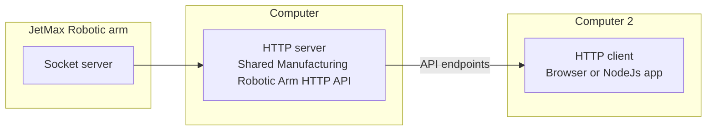

# Shared Manufacturing Robotic Arm HTTP Server

## Jetmax Robotic Arm
Hiwonder JetMax JETSON NANO Robot Arm ROS Open Source robot, more info: https://www.hiwonder.hk/collections/jetson/products/hiwonder-jetmax-jetson-nano-robot-arm-ros-open-source-vision-recognition-program-robot

## Communication overview
Jetmax robotic arm runs websocket server to wich **Shared Manufacturing Robotic Arm HTTP Server** is connecting. **Shared Manufacturing Robotic Arm HTTP Server** represents middleware server that enables communication with JetMax robotic arm via specified HTTP API. 



## HTTP API basic info
* **retrieve robotic arm state**
    * x, y, z coordinates of the robotic arm end effector
    * positions of 3 servo motors
    * positions of 3 joints
    * valuess of 2 PWM signals
    * state of the end effector sucker
* **move robotic arm to a specific location**
    * x, y, z coordinates
    * absolute move
* **move robotic arm from a specific state**
    * dx, dy, dz
    * relative move
    
## Server-side application setup
* download the application code to the JetMax Ubuntu computer
* open terminal window and move to the folder where the application code was downloaded
* run <code>npm install</code> to install the required Node.js modules
* open config.json file and define the address of the JetMax Ubuntu computer and the port for the Node.js application
* run <code>nodejs index.js</code> to start the application

## Client-side application usage
* Install and use **axios** as an HTTP client. 
* API endpoints:

| API endpoint | description | parameter(s) | returns |
| ------------ | ----------- | ------------ | ------- |
| <code>/basic/state</code> | retrieve full robotic arm data | / | JSON object |
| <code>/basic/moveTo</code> | absolute move to a specific location | <code>msg={"x": a, "y" = b, "z" = c}</code> | /
| <code>/basic/move</code> | relative move from current location | <code>msg={"x": a, "y" = b, "z" = c}</code> | /
| <code>/basic/suction</code> | enable or disable the suction of the robotic arm | <code>msg={"data": true/false}</code> | /

* **Examples of usage:**
    * calling API endpoint with no parameters
    ```
    // call /basic/state API endpoint
    axios.get('http://' + jetmaxUbuntServerIpAddress + '/basic/state')
    // handle response
        .then(function (response) {
            console.log("/basic/state response received, data:" + JSON.stringify(response.data));
            // process data ...
        })
        // handle error
        .catch(function (error) {
            console.error("Error calling /basic/state API endpoint.");
            console.error(error); 
        });
    ``` 
  
    * calling API endpoint with parameters
    ``` 
    // call /basic/move API endpoint
    axios.get('http://' + jetmaxUbuntServerIpAddress + '/basic/move', {
        params: {msg:{"x": 0, "y": -150, "z": 200}}
    })
		// handle response
        .then(function (response) {
            console.log("/basic/state response received, data:" + JSON.stringify(response.data));
            // process data ...
        })
		// handle error
        .catch(function (error) {
            console.error("Error calling /basic/state API endpoint.");
            console.error(error); 
        });
    ``` 

* **Notes**:
    * <code>/basic/moveTo</code> API endpoint has a pre-set duration of the move 100 ms, the moves are slow.
    * <code>/basic/move</code> endpoint has a pre-set duration of the move of 0.1 ms. **The moves are fast, do not make big changes!**
    * When moving the robotic arm consider the limits of the robotic arm and of the operational area. 

## Formats of data
* JetMax robotic arm state JSON object: 
```json
{
"x": 0, 
"y": -150, 
"z": 200, 
"servo1": 500, 
"servo2": 500, 
"servo3": 520, 
"joint2": 84.4424819946289, 
"joint3": 4.903716564178467, 
"joint1": 120, 
"pwm1": 90, 
"pwm2": 90, 
"sucker": false
}
```
* <code>/basic/moveTo</code> endpoint parameter msg:
```json
{
"x": 0, 
"y": -150, 
"z": 200
}
```
* <code>/basic/move</code> endpoint parameter msg:
```json
{
"x": 0, 
"y": 10, 
"z": 0
}
```
